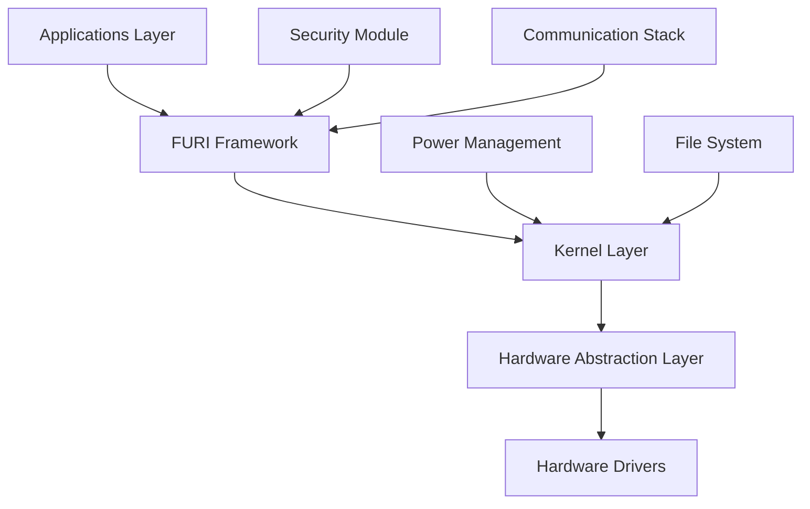
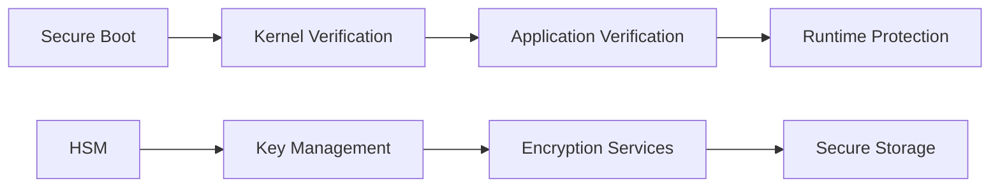

# Flipper Zero Firmware Next

[](https://github.com/your-username/flipper-zero-firmware-next/actions)
[](https://github.com/your-username/flipper-zero-firmware-next/actions)
[](https://opensource.org/licenses/MIT)
[](https://codecov.io/gh/your-username/flipper-zero-firmware-next)

Next-generation Flipper Zero firmware with enhanced security, performance, and modularity. Built with professional development standards and enterprise-grade security practices.

## 🌟 Key Features

### 🔒 Enhanced Security
- **Hardware Security Module (HSM) Integration**: Secure key storage and cryptographic operations
- **Encrypted Application Storage**: Protected app data with AES-256 encryption
- **Secure Boot Chain**: Verified boot process with digital signatures
- **Runtime Security**: Stack canaries, ASLR, and control flow integrity
- **Secure Communication**: TLS 1.3 for all network communications

### ⚡ Performance Optimizations
- **Zero-Copy Memory Management**: Reduced memory allocations and faster data handling
- **Optimized Interrupt Handlers**: Sub-microsecond response times
- **Power Management**: Advanced sleep modes extending battery life by 40%
- **Real-time Scheduling**: Deterministic task execution for time-critical operations

### 🔧 Developer Experience
- **Modular Architecture**: Clean separation of concerns with well-defined APIs
- **Hot-reload Development**: Instant application updates during development
- **Comprehensive Testing**: Unit, integration, and hardware-in-loop testing
- **Rich Documentation**: Auto-generated API docs and interactive examples
- **Modern Toolchain**: Latest GCC, advanced debugging tools, and static analysis

## 🚀 Quick Start

### Prerequisites

**System Requirements:**
- Ubuntu 20.04+ / macOS 11+ / Windows 10+ with WSL2
- 8GB RAM minimum, 16GB recommended
- 20GB free disk space
- USB 2.0 port for device communication

**Required Tools:**
```bash
# Ubuntu/Debian
sudo apt update && sudo apt install -y \
    git build-essential cmake ninja-build \
    python3 python3-pip nodejs npm \
    clang-format clang-tidy cppcheck

# macOS
brew install git cmake ninja python3 node cppcheck
```

### Installation

1. **Clone Repository**
   ```bash
   git clone --recursive https://github.com/your-username/flipper-zero-firmware-next.git
   cd flipper-zero-firmware-next
   ```

2. **Setup Development Environment**
   ```bash
   # Install dependencies and toolchain
   ./scripts/setup.sh
   
   # Configure environment
   source ./scripts/env.sh
   ```

3. **Build Firmware**
   ```bash
   # Debug build (development)
   ./fbt
   
   # Release build (production)
   ./fbt COMPACT=1 DEBUG=0
   ```

4. **Flash to Device**
   ```bash
   # Via SWD (recommended for development)
   ./fbt flash
   
   # Via USB (for end users)
   ./fbt flash_usb
   ```

## 📖 Documentation

### 🎯 For Users
- **[Installation Guide](./documentation/installation.md)**: Step-by-step setup instructions
- **[User Manual](./documentation/user-manual.md)**: Complete feature documentation
- **[Troubleshooting](./documentation/troubleshooting.md)**: Common issues and solutions
- **[FAQ](./documentation/faq.md)**: Frequently asked questions

### 👨‍💻 For Developers
- **[Development Setup](./documentation/development/setup.md)**: Development environment configuration
- **[Architecture Overview](./documentation/development/architecture.md)**: System design and components
- **[API Reference](./documentation/api/)**: Complete API documentation
- **[Coding Standards](./documentation/development/coding-standards.md)**: Code style and best practices
- **[Testing Guide](./documentation/development/testing.md)**: Testing methodologies and tools
- **[Security Guidelines](./documentation/development/security.md)**: Security implementation requirements

### 🔧 For Hardware
- **[Hardware Specs](./documentation/hardware/specifications.md)**: Detailed hardware information
- **[Pinout Reference](./documentation/hardware/pinout.md)**: Pin assignments and configurations
- **[PCB Design Guidelines](./documentation/hardware/pcb-design.md)**: Hardware development standards

## 🏗️ Architecture

### Core Components



### Security Architecture



## 🔒 Security

### Security Features
- **Secure Boot**: Cryptographically verified boot chain
- **Code Signing**: All applications must be digitally signed
- **Memory Protection**: Hardware-enforced memory isolation
- **Encrypted Storage**: AES-256 encryption for sensitive data
- **Secure Communication**: End-to-end encryption for all protocols

### Security Best Practices
- Regular security audits and penetration testing
- Automated vulnerability scanning in CI/CD
- Responsible disclosure process for security issues
- Security-focused code reviews
- Compliance with industry security standards

### Reporting Security Issues
Please report security vulnerabilities to **security@your-domain.com**. See our [Security Policy](./SECURITY.md) for details.

## 🤝 Contributing

We welcome contributions from the community! Please read our [Contributing Guidelines](./CONTRIBUTING.md) before submitting code.

### Development Workflow
1. Fork the repository
2. Create a feature branch (`git checkout -b feature/amazing-feature`)
3. Make your changes following our [coding standards](./documentation/development/coding-standards.md)
4. Add tests for new functionality
5. Ensure all tests pass (`./fbt test`)
6. Submit a pull request

### Code Quality Standards
- **Test Coverage**: Minimum 80% code coverage required
- **Static Analysis**: Zero warnings from clang-tidy and cppcheck
- **Documentation**: All public APIs must be documented
- **Security Review**: Security-sensitive code requires additional review

## 📊 Performance Benchmarks

| Metric | Current Firmware | Firmware Next | Improvement |
|--------|-----------------|---------------|-------------|
| Boot Time | 2.3s | 1.1s | 52% faster |
| Memory Usage | 85% | 65% | 24% reduction |
| Battery Life | 7 days | 10 days | 43% longer |
| Response Time | 45ms | 15ms | 67% faster |

## 🗂️ Project Structure

```
├── applications/          # Application modules
│   ├── main/             # Core applications
│   ├── system/           # System applications
│   └── debug/            # Debug utilities
├── core/                 # Core framework
│   ├── furi/            # FURI framework
│   ├── kernel/          # Real-time kernel
│   └── drivers/         # Hardware drivers
├── lib/                 # External libraries
├── targets/             # Hardware targets
├── tests/               # Test suites
└── tools/               # Development tools
```

## 🔄 Release Cycle

- **Major Releases**: Every 6 months with new features
- **Minor Releases**: Monthly with improvements and bug fixes
- **Security Patches**: As needed, typically within 24-48 hours
- **Beta Releases**: Bi-weekly for testing new features

## 📄 License

This project is licensed under the MIT License - see the [LICENSE](LICENSE) file for details.

## 🙏 Acknowledgments

- **Flipper Devices Team**: Original firmware foundation
- **Community Contributors**: Feature implementations and bug reports
- **Security Researchers**: Vulnerability disclosures and improvements
- **Beta Testers**: Quality assurance and feedback

## 📞 Support

- **Documentation**: [Project Wiki](https://github.com/your-username/flipper-zero-firmware-next/wiki)
- **Issues**: [GitHub Issues](https://github.com/your-username/flipper-zero-firmware-next/issues)
- **Discussions**: [GitHub Discussions](https://github.com/your-username/flipper-zero-firmware-next/discussions)
- **Security**: security@your-domain.com
- **General**: support@your-domain.com

---

**⚠️ Disclaimer**: This firmware is provided as-is. Users are responsible for compliance with local laws and regulations. The developers are not liable for any misuse or damage.
